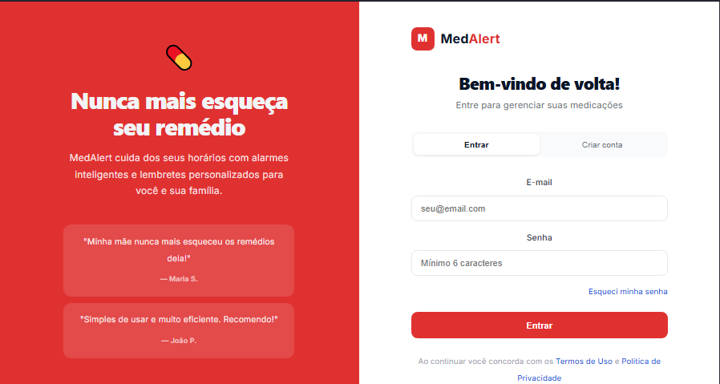
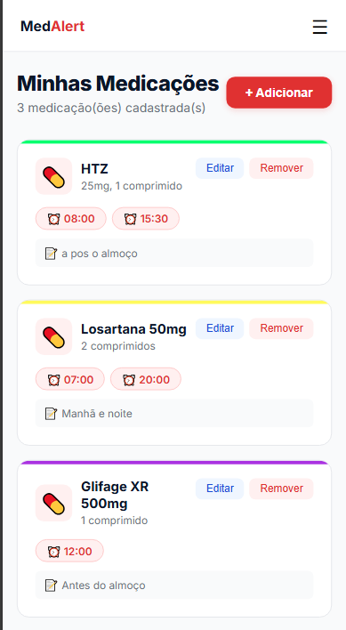

# MedAlert 💊

Aplicação web para gerenciamento de medicamentos e lembretes de doses. O usuário cadastra seus remédios, define horários e recebe notificações para não perder nenhuma dose.

## Telas

### Desktop



### Mobile



## Funcionalidades

- Cadastro e autenticação de usuários (JWT)
- Cadastro, edição e remoção de medicamentos
- Confirmação de doses tomadas
- Histórico de doses
- Recuperação de senha por e-mail
- Notificações push via Web Push (VAPID)

## Tecnologias

### Frontend

| Tecnologia | Versão |
|---|---|
| React | 19 |
| Vite | 8 |
| React Router DOM | 7 |

### Backend

| Tecnologia | Descrição |
|---|---|
| Node.js + Express 5 | Servidor e API REST |
| MongoDB Atlas + Mongoose 9 | Banco de dados em nuvem |
| JWT (jsonwebtoken) | Autenticação via token |
| bcryptjs | Criptografia de senhas |
| nodemailer | Envio de e-mails (Gmail SMTP) |
| web-push | Notificações push (VAPID) |
| node-cron | Agendamento de notificações |

## Como executar

### Pré-requisitos

- Node.js 18+
- Conta no [MongoDB Atlas](https://www.mongodb.com/atlas)

### Backend

```bash
cd backend
npm install
# Configure as variáveis de ambiente no arquivo .env
npm run dev
```

### Frontend

```bash
cd frontend
npm install
npm run dev
```

O frontend abrirá automaticamente no navegador em `http://localhost:5174`.

## Variáveis de ambiente (backend)

Crie um arquivo `.env` dentro da pasta `backend/` com as seguintes variáveis:

```env
PORT=3001
MONGODB_URI=sua_uri_do_mongodb_atlas
JWT_SECRET=sua_chave_secreta
JWT_EXPIRES_IN=7d
FRONTEND_URL=http://localhost:5174
EMAIL_HOST=smtp.gmail.com
EMAIL_PORT=587
EMAIL_USER=seu@gmail.com
EMAIL_PASS=sua_senha_de_app_gmail
EMAIL_FROM=seu@gmail.com
VAPID_PUBLIC_KEY=sua_vapid_public_key
VAPID_PRIVATE_KEY=sua_vapid_private_key
VAPID_EMAIL=mailto:seu@gmail.com
```
